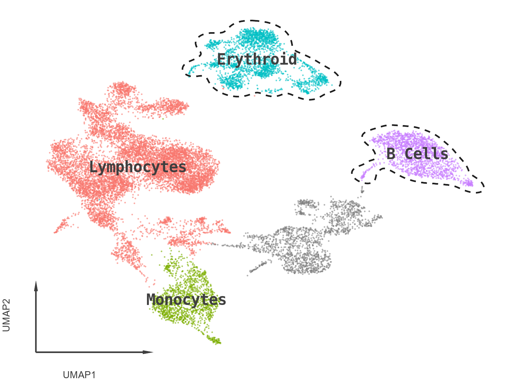
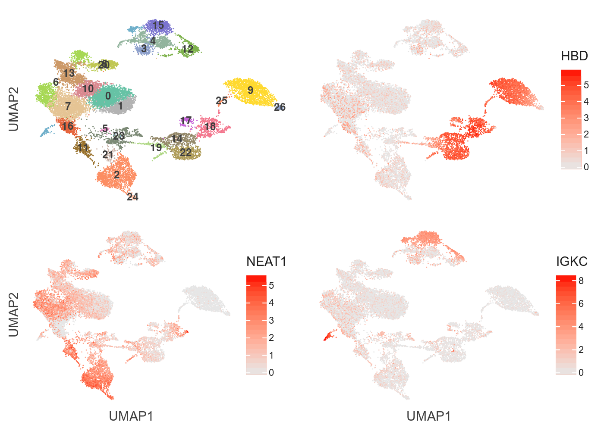

# Cellestial
[](https://github.com/DataVil/Cellestial) 
[](https://pypi.org/project/cellestial/)


The __Grammar of Graphics__ for single-cell omics.


### Installation

```bash
pip install cellestial
```

### Introduction


__Cellestial__ is an interactive and a highly customizable _Single-Cell_ & _Spatial_ omics data visualization library. Built on top [Lets-Plot](https://lets-plot.org/), it offers a ggplot-like layered and modular approach offering __high customizability__ and __publication-ready figures__. 

Cellestial is highly integrated with scverse's [AnnData](https://github.com/scverse/anndata) with room for integration with any upcoming single-cell omics data type in the Python single-cell omics ecosystem.

Cellestial leverages the performance of [Polars](https://pola.rs/) ensuring speed and scalability.

_Cellestial is built-on top the following core design philosophies:_
1. Modularity over abstraction
1. Predictability over flexibility
1. Explicity over implicity
1. Simplicity & Expressiveness


with _reproduciblity_, _intiutiveness_ & _ease-of-use_, and, of course, _beautiful publication-ready plots/charts/figures_ in mind.

[__More on Design Philosophy__](./philosophy.md)


To see the example Figures visit [Cellestial Webpage](https://datavil.github.io/cellestial-examples/).

### Example Plots Grid


### Usage

```python
import cellestial as cl
```

### Tooltips
```python
umap = cl.umap(
    data,
    key="cell_type_lvl1",
    size=1,
    axis_type="arrow",
    alpha=0.6,
    tooltips=["cell_type_lvl1", "n_genes","pct_counts_in_top_50_genes"],
    legend_ondata=True,
    ondata_size=12,
    ondata_fontface="bold",
    ondata_family="mono",
    ondata_alpha=0.8,
)
```


### Layered/Modular Approach

The ggplot-like API allows adding layers and customizing the plot.

```python
# modify plot size and color palette
umap += ggsize(800, 600) + scale_color_hue()
# highlight clusters
umap + cl.cluster_outlines(dim,["B Cells","Erythroid"])
```


### Zooming and Paning Options
TODO

### Grid plots

Instead of singular function names (`umap`), multi/grid plots requires the plural (`umaps`),providing predictability which guarentees the reproducibility.

Which are valid for all `dimensional` subsets (`expression`,`pca`,`umap`, `tsne`).

```python
cl.umaps(
    data,
    keys=["leiden", "HBD", "NEAT1", "IGKC"],
    ncol=2,
    size=1,
    color_high="red",
) + ggsize(900, 600)
```
