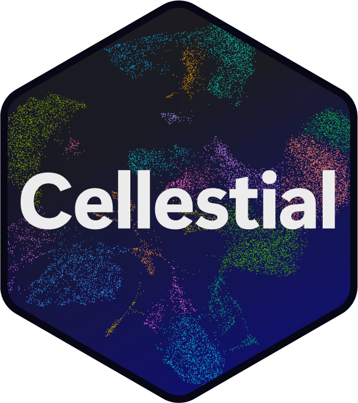
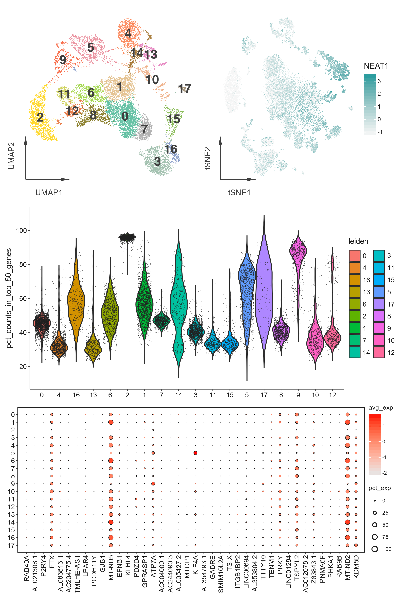
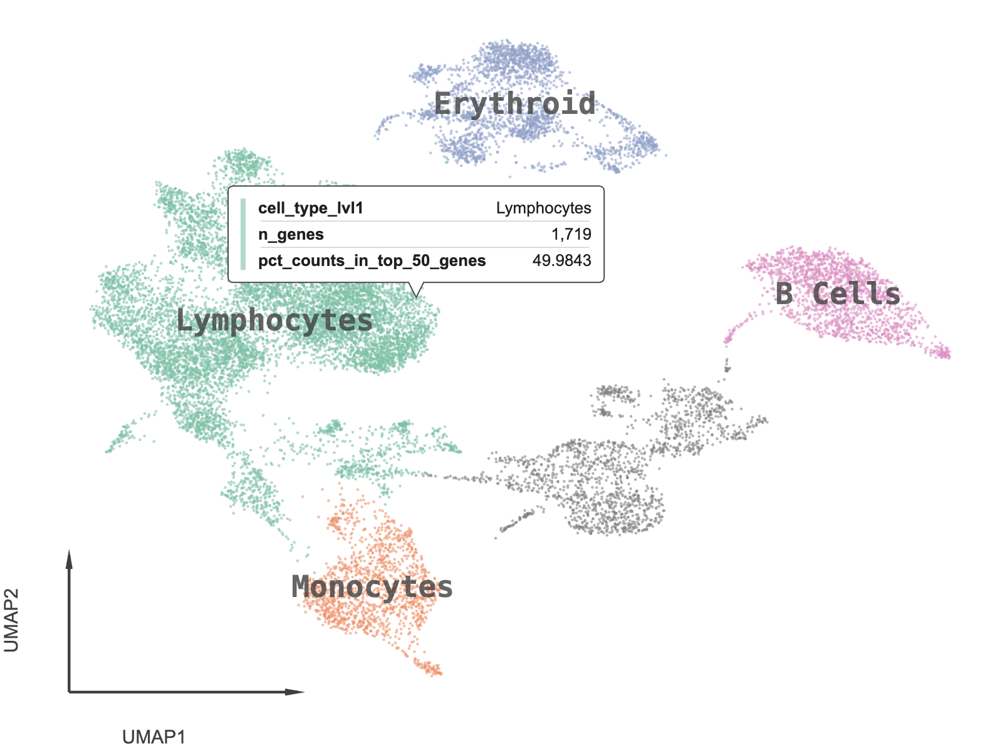
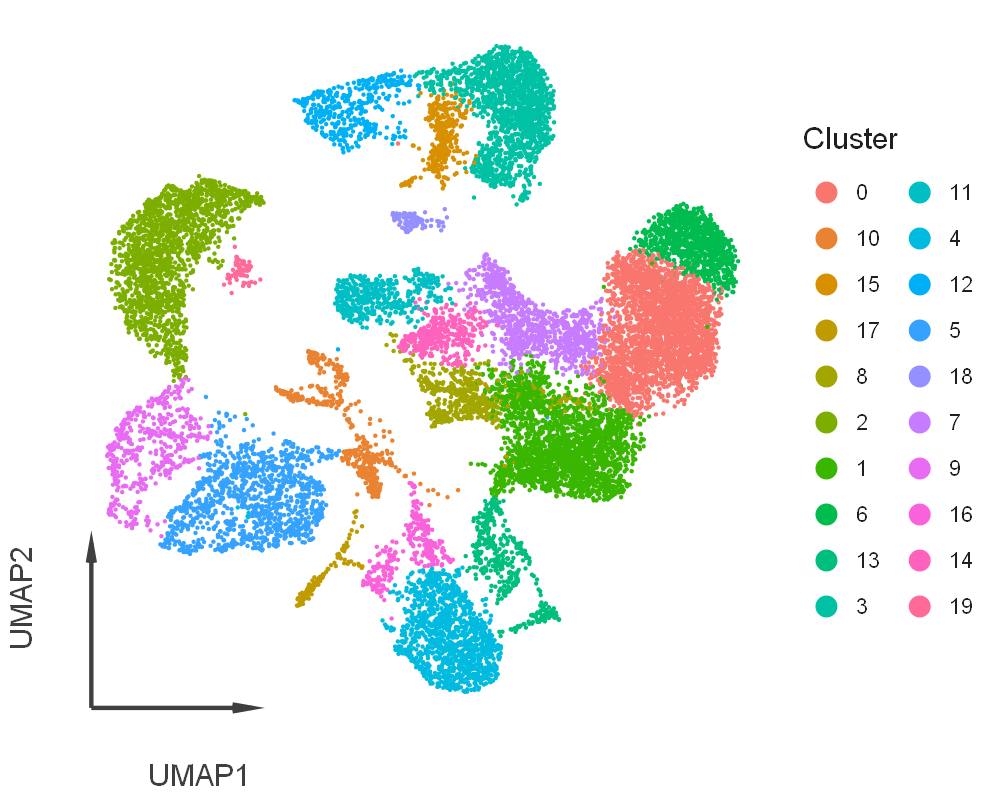
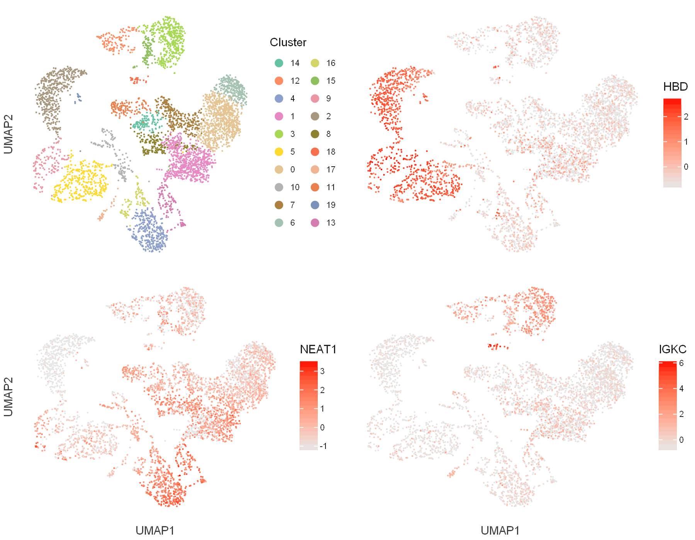

# Cellestial
[](https://github.com/DataVil/Cellestial) 
[](https://pypi.org/project/cellestial/)



The __Grammar of Graphics__ for single-cell omics.


### Installation

```bash
pip install cellestial
```

### Introduction


__Cellestial__ is an interactive and a highly customizable _Single-Cell_ & _Spatial_ omics data visualization library. Built on top [Lets-Plot](https://lets-plot.org/), it offers ggplot-like layered thus modular approach offering __high customizability__ and __publication-ready figures__. 

Cellestial is highly integrated with scverse's [AnnData](https://github.com/scverse/anndata) with room for integration with any upcoming single-cell omics data type in the Python single-cell omics ecosystem.

Cellestial leverages the performance of [Polars](https://pola.rs/) for scalability.

_Cellestial is built-on top the following core design philosophies:_
1. Modularity over abstraction
1. Predictability over flexibility
1. Explicity over implicity
1. Simplicity & Expressiveness

with _reproduciblity_, _intiutiveness_ & _ease-of-use_, and, of course, _beautiful publication-ready plots/charts/figures_ in mind.

### Design Philosophy

These design philosophies are mainly borrowed from ggplot, Zen of Python, and Rust.

1. Modularity over abstraction

Abstraction is nice but sacrifices customizability. If the user can provide `+ ggsize(800,600)` and change the figure size at any point, there is no need to accept for plotting functions _width_ or _heigth_ as paramaters. The same applies to the many other possible layers and aesthetics of the plot. This approach is particularly useful with notebooks and _exploratary data analysis_, EDA. On top of eliminating unncessary complexity, the approach eliminates the risk of conflicting arguments.

2. Predictability over flexibility

Flexibility provides convenience but sacrifices predictibality. If providing a single key produces a single plot and providing a sequence of keys prodcues a grid of plots the return type would be different (i.e, `PlotSpec` vs `SupPlotsSpec`) for the same function. The follow-up workflow would have to be totally different for these two cases.

Cellestial ensures reproducibility by strict return types. Naming convention allows such strict return types. Instead of `cl.umap()` accepting a sequence of keys (`Sequence[str]`) and returning a grid of plots (`SupPlotsSpec`), it only accepts a single key (`str`) it is guaranteed to return a single plot (`PlotSpec`).

Plural versions of such functions are available, if the user needs a grid of plots with provided keys. For instance, `cl.umaps()` requires a sequence of strings as keys and is guaranteed to return grid of plots (`SupPlotsSpec`).

In case the user wants to merge multiple violins/boxplot geoms on a single plot, the user can simply call the `cl.violin()` or `cl.boxplot()` with sequence of keys which strictly return `PlotSpec`. However, if the user wants the grid with the same keys, the sequence can be provided to the plural versions of the same plot types i.e `cl.violins()` or `cl.boxplots()` which are guaranteed to return `SupPlotsSpec`.


3. Explicity over implicity

Explicit function and parameter names allow the users to be fully aware and sure of what they are doing. While it is more convenient or easier to write `vln()` or `inc_dims =` instead of `violin()` or `include_dimensions =`, the former is less intuitive and requires users to remember how the programmer choose to shorten the words. 


4. Simplicity & Expressivenes 

Cellestial is a data visualization library, therefore the plotting functions names does not have to include keywords such as _plot_ in the names nor they have to be in different namespaces. Cellestial API is simple enough for most users yet expressive enough for users to know what exactly they are using.


To see the example Figures visit [Cellestial Webpage](https://datavil.github.io/cellestial/).




### Usage

```python
import cellestial as cl
```

#### Interactive tooltips of individual data points
```python
umap = cl.umap(data, size=1, axis_type="arrow")
umap
```


and tooltips can be extended with other features..

#### Zooming and Paning Options
```python
umap = cl.umap(data, size=1, axis_type="arrow", interactive=True)
```


#### Plots are exteremly customizable

```python
umap + scale_color_hue() + ggsize(500,400)
```



#### Multi plots are distinct functions

Instead of singular function names (`umap`), multi-grid plots requires the plural (`umaps`),providing predictability which guarentees the reproducibility.

Which are valid for all `dimensional` subsets (`expression`,`pca`,`umap`, `tsne`).

```python
cl.umaps(
    data,
    keys=["leiden", "HBD", "NEAT1", "IGKC"],
    ncol=2,
    size=1,
    color_high="red",
) + ggsize(900, 600)
```
