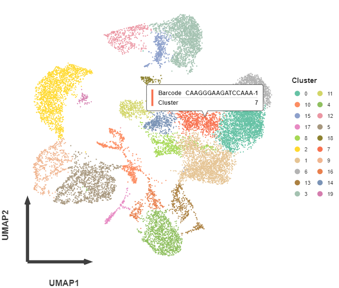
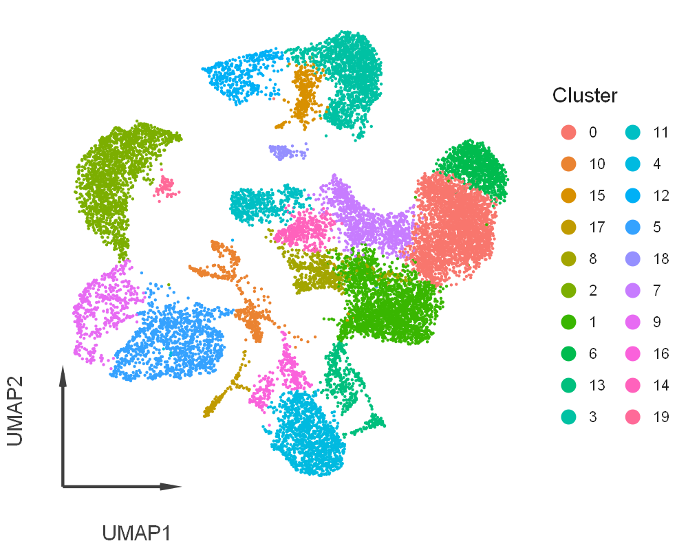

<p align="center">
    
</p>

[](https://github.com/DataVil/Cellestial) [](https://pypi.org/project/cellestial/)

# Cellestial

An Interactive and Highly Customizable __Single-Cell__ & __Spatial__ Plotting Tool over a ggplot-like API.

Name Encuplates: Space (of Spatial), Scatters of Stars, and of course Cells.

## Installation

```bash
pip install cellestial
```

## Usage

```python
import cellestial as cl
```

Interactive tooltips of individual data points
```python
umap = cl.umap(data, size=1, axis_type="arrow")+ggsize(700,500)
umap
```



### Plots are exteremly customizable

```python
umap + scale_color_hue() + ggsize(500,400)
```



### Multi plots are different function

Instead of singular function names (`umap`), multi-grid plots requires the plural (`umaps`),providing predictability which guarentees the reproducibility.

Which are valid for all `dimensional` subsets (`expression`,`pca`,`umap`, `tsne`).


